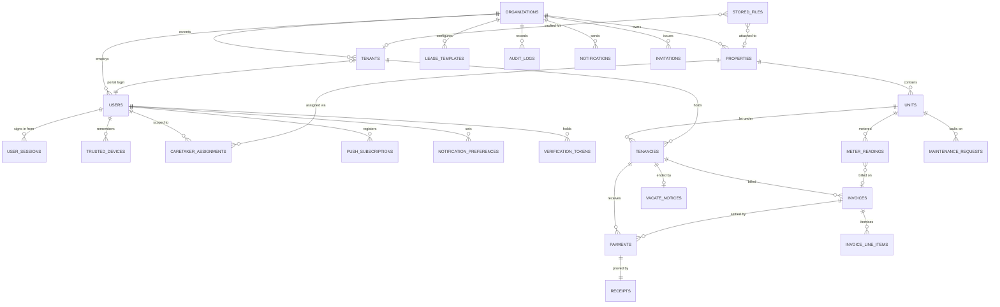

# RentFlow Kenya — Data Model

> Schema through Phase 3 (Sprints 1–18), plus Sprint 26A. Current Alembic head:
> `a4b5c6d7e8f9`.
>
> Phases 1 and 2 are described in full below. The Phase 3 tables are summarised
> in their own section; each model file carries the reasoning that would
> otherwise be repeated here.
>
> **Known gap:** the tables added by Sprints 19–25 (API keys and webhooks,
> customer success, reporting, AI and fraud, partner integrations, privacy and
> WebAuthn) are in the migration list at the bottom but not yet described here.
> That drift predates Sprint 26A and is called out rather than papered over.

## Multi-tenant isolation strategy

Every tenant-owned table carries `organization_id`, supplied by the
`OrgScopedMixin` in [`app/models/base.py`](../backend/app/models/base.py) rather
than repeated per model. Isolation is enforced twice, deliberately:

1. **Application layer** — `app.api.deps.OrgContext` resolves the caller's
   organization on every request, and `assert_in_org` is the single place that
   decides a cross-tenant read is a **403, never a 404**. A 404 would confirm the
   id exists.
2. **Database layer** — PostgreSQL Row Level Security. Every tenant table has a
   policy comparing `organization_id` against the transaction-scoped setting
   `app.current_org_id`. With no context set, policies match **nothing**, so a
   forgotten scope is an empty result rather than a silent leak.

Table owners bypass RLS, which is what allows Celery tasks and the unauthenticated
M-Pesa callback to work across organizations. In production, grant day-to-day
access to a non-owner role so the policies actually bite.

Caretakers get a third layer: `caretaker_assignments` limits them to named
properties, and `accessible_property_ids` folds that into every portfolio query.

---

## Entity relationship diagram



---

## Tables

### Identity and access

| Table | Purpose | Key constraints |
|---|---|---|
| `organizations` | The SaaS tenant. Everything hangs off this. | `slug` unique |
| `users` | Staff and tenant-portal logins across all 8 roles. | `email`, `phone_number` globally unique |
| `user_sessions` | One live login. Holds the **hash** of the current refresh token so rotation can detect reuse. | indexed on `refresh_token_hash` |
| `trusted_devices` | Devices that completed 2FA and asked to be remembered (30 days). | |
| `verification_tokens` | Single-use hashed link tokens: email verification, password reset, tenant-portal invite. | `token_hash` unique |
| `invitations` | Staff invitations with seeded property assignments and cash limit. | `token_hash` unique |

Refresh tokens rotate on every use. Presenting a *superseded* token is treated as
theft and revokes every session the user has — see `session_service.rotate`.

### Portfolio

| Table | Purpose | Key constraints |
|---|---|---|
| `properties` | Buildings, blocks, fleets. Carries the per-unit water and electricity rates that price meter readings. | `(organization_id, reference_code)` unique |
| `units` | The rentable thing. Status is a consequence of tenancy, never set by hand. | `(property_id, unit_number)` unique |
| `caretaker_assignments` | Which properties a caretaker may operate on, plus their cash ceiling. | `(user_id, property_id)` unique |

Unit statuses: `vacant`, `occupied`, `under_maintenance`, `reserved`, `vacating`.

### Tenancy

| Table | Purpose | Key constraints |
|---|---|---|
| `tenants` | The person, their KYC documents and emergency contact. | `(organization_id, phone_number)` unique |
| `tenancies` | The rental relationship. Status is **derived from dates**, never stored by hand. | `(organization_id, reference_code)` unique |
| `lease_templates` | Landlord-authored lease body with `{{variable}}` placeholders; versioned. | |

Tenancy statuses derive from `start_date`, `end_date`, `notice_given_at` and
`vacated_at` in `tenant_service._derive_status`: `active`, `expiring_soon`
(within 60 days), `expired`, `notice_given`, `vacated`.

### Money

| Table | Purpose | Key constraints |
|---|---|---|
| `invoices` | One per tenancy per billing period. | `(tenancy_id, period_start)` unique — this is what makes the daily Celery run idempotent |
| `invoice_line_items` | Rent, utilities, arrears carried forward, late fees. | |
| `payments` | M-Pesa, cash, bank or cheque. | `mpesa_receipt` **globally unique** — the same money can never be banked twice |
| `receipts` | Tamper-evident proof. `signature` is an HMAC over the immutable facts. | `payment_id` unique |

Money is `NUMERIC(12,2)` throughout and handled as Python `Decimal` — never float.

Payments settle **oldest invoice first** (`payment_service._allocate`).

### Operations

| Table | Purpose | Key constraints |
|---|---|---|
| `meter_readings` | Water/electricity with a **mandatory photo**. Consumption and amount are computed at capture time, so a later rate change never rewrites past bills. | `(unit_id, meter_type, reading_date)` unique |
| `maintenance_requests` | Faults from caretakers and tenants, with photos and priority. | `(organization_id, reference_code)` unique |
| `vacate_notices` | Tenant's digital notice, validated against the lease's notice period. | |
| `stored_files` | Metadata for objects in Cloudflare R2. Bytes never pass through the API. | `storage_key` unique |
| `audit_logs` | Append-only. Doubles as the caretaker activity log — hence the optional GPS columns. | indexed on `(entity_type, entity_id)` and `(organization_id, created_at)` |

### Communications

| Table | Purpose |
|---|---|
| `notifications` | One row **per channel per event**, so a partial failure is visible |
| `notification_preferences` | Per-user opt-outs. A missing row means enabled — users only store exceptions |
| `push_subscriptions` | Web Push endpoints, one per browser |

Payment, receipt, security and account notifications are **mandatory** and ignore
preferences (`notification_service.MANDATORY_TYPES`).

### Phase 3 — screening, commercial, marketing, facilities, hire

All of these carry `organization_id` and sit inside the RLS policy set; the list
they are registered in is `PHASE_3_ORG_SCOPED_TABLES` in
[`app/core/rls.py`](../backend/app/core/rls.py), and
`tests/test_phase3.py` fails if a table is added without both.

| Table | Purpose | Why it is shaped this way |
|---|---|---|
| `vendors` | The approved contractor list, with specialties, ratings and job counts. | Not a `User`: most fundis never log in. Ratings are a running total and count so "who is my best plumber" needs no join. |
| `tenant_applications` | Someone applying for a vacant unit, with their score. | Deliberately **not** a `Tenant` — most applicants never become one, and folding them in would poison every duplicate check. |
| `guarantors` | Who stands behind the tenant, and whether they agreed. | Carries its own token: a guarantor is worthless unless they knew they were one. |
| `reference_checks` | The previous landlord's two-question verdict. | `NO_RESPONSE` is a real state — silence is a signal, not a gap. |
| `service_charge_schemes` / `_budgets` / `_expenses` | What was budgeted, charged and spent on a building. | Three separate truths. A scheme that cannot show all three is one tenants are right to dispute. |
| `sinking_fund_entries` | The reserve held back for capital work. | A ledger, not a balance column, so the reserve can be explained line by line. |
| `bulk_operations` | Preview then execute, with the resolved target list stored. | Execution runs over the stored list, so it can never quietly widen its blast radius. |
| `vacancy_listings` | The shareable advert for one empty unit. | Its own opaque, rotatable slug rather than the unit id — the link is pasted into WhatsApp groups. |
| `inquiries` | Everyone who asked before they were ready to apply. | Tiny on purpose: a name and a number is all anyone gives before a viewing. |
| `data_exports` | A log of who took what data, and when. | This is the whole tenant book leaving the building. |
| `compliance_items` | Certificates, licences and insurance, with expiry. | Expiry is indexed and drives a 90/60/30/7-day ladder. No expiry recorded is `MISSING`, never "valid". |
| `parking_bays` / `parking_allocations` | Bays and who holds them. | A visitor allocation is the same row with a guest name, so the conflict check is one query. |
| `amenities` / `amenity_bookings` | Bookable shared facilities. | A maintenance block is a booking with `status = BLOCKED`, so overlap detection cannot disagree with itself. |
| `utility_accounts` | The building's own KPLC and water accounts. | Defaults to `UNKNOWN`: nobody has checked is more honest than assuming paid. |
| `rental_assets` | Vehicles and equipment, one table, `kind` discriminator. | A car and a generator are the same business. Vehicle compliance lives here, checked per hire rather than annually. |
| `rental_agreements` | One hire, with condition snapshots at both ends. | Mileage, fuel and photos out and back turn "you scratched it" into a comparison. |

### Sprint 26A — masterplan gap closure

Three of these carry `organization_id` and are registered in
`PHASE_9_ORG_SCOPED_TABLES`. Two deliberately do not, and the reason is the
same in both cases: they are not read on a tenant's behalf.

| Table | Purpose | Why it is shaped this way |
|---|---|---|
| `management_agreements` | The owner-agency contract, with its terms frozen as signed. | `owner_profiles` holds the *operative* terms the disbursement run charges; this holds what was *agreed*. When the two disagree, both being visible is the difference between an argument and an audit. Both signatures are ordinary `digital_signatures` rows, so dual signing reuses the OTP pipeline rather than growing a second one. |
| `communication_templates` | An organisation's own wording for one notification type on one channel. | Absent a row, the service's hardcoded copy still sends — which is what makes this additive. A channel-specific row beats the `ANY` catch-all, so a terse SMS and a fuller email can coexist for one event. |
| `demo_datasets` | The receipt for one sample-data seeding run. | Records the exact ids created, in order, so teardown walks it in reverse. Nothing is matched by name or heuristic, so removing the sample can never take a customer's own row with it. |
| `security_breaches` | The Kenya DPA s.43 register and its 72-hour clock. | **Platform-level, like `task_runs`.** One incident routinely spans several customers and the party who must notify the Data Commissioner is RentFlow, not the landlord. Affected customers are a JSONB list on the row, and each is told separately because they are the controller for their own tenants' data. |
| `organization_encryption_keys` | Per-organisation data encryption keys, themselves wrapped. | **Not org-scoped for RLS**, because it is touched only by the server's own crypto path and never by a request-scoped query on a tenant's behalf. Old key versions are retained rather than deleted, so rotation does not require a coordinated re-encryption pass. |

Column-level additions in the same migration: OCR evidence on `meter_readings`
(`ocr_reading`, `ocr_confidence`, `ocr_accepted` — `None` on the last one means
no suggestion was offered, which is not the same as one being rejected); dual
approval on `payments`; suspension, cash threshold, session cap and demo flag on
`organizations`; and video fields on `help_articles`.

---

## Reference codes

Random rather than sequential, so a competitor cannot infer portfolio size from a
code. The alphabet excludes `I`, `O`, `0` and `1` because codes get read aloud
and written down.

`BR-` is the one exception and is deliberately sequential within the year: an
incident number is quoted in correspondence with a regulator, and there is no
portfolio size to leak from RentFlow's own breach count.

| Prefix | Entity | Example |
|---|---|---|
| `PRP-` | Property | `PRP-7K2M9Q` |
| `UNT-` | Unit | `UNT-4XB8ZH` |
| `TNT-` | Tenant | `TNT-5HFKHU` |
| `TCY-` | Tenancy | `TCY-3WR6XE` |
| `INV-` | Invoice | `INV-2026-09-L7FGJ` |
| `PMT-` | Payment | `PMT-M2SBRS` |
| `RCT-` | Receipt | `RCT-KMZ975` |
| `MNT-` | Maintenance | `MNT-QB4T7D` |
| `MGT-` | Management agreement | `MGT-9PXR4C` |
| `BR-` | Security breach | `BR-2026-0007` |

---

## Migrations

| Revision | Contents |
|---|---|
| `978bef97001b` | Initial: organizations, users |
| `becdc2a16b45` | Phase 1: portfolio, tenancy, billing, operations, notifications |
| `2c1d19d1badc` | Row Level Security policies |
| `a1b2c3d4e5f6` → `a7b8c9d0e1f2` | Phase 2: agency mode, inspections, signatures, eTIMS, renewals, task telemetry, hot-path indexes |
| `b8c9d0e1f2a3` | Sprint 13: vendor registry, full maintenance lifecycle, property maintenance budget |
| `c9d0e1f2a3b4` | Sprint 14: tenant applications, guarantors, landlord reference checks |
| `d0e1f2a3b4c5` | Sprint 15: service charges, commercial unit fields, bulk operations |
| `e1f2a3b4c5d6` | Sprint 16: vacancy listings, lead pipeline, data exports |
| `f2a3b4c5d6e7` | Sprint 17: compliance calendar, parking, amenities, utility accounts |
| `a3b4c5d6e7f8` | Sprint 18: rental assets and hire agreements |
| `c1d2e3f4a5b6` → `9b1c2d3e4f5a` | Sprints 19–25: API keys and webhooks, customer success, reporting, AI/fraud/security hardening, partner integrations, privacy and WebAuthn |
| `a4b5c6d7e8f9` | Sprint 26A: management agreements, communication templates, demo datasets, the breach register, per-organisation encryption keys, meter OCR, dual cash approval |

```bash
cd backend
alembic upgrade head          # apply
alembic downgrade -1          # roll back one
alembic revision --autogenerate -m "..."   # after changing models
```

Autogenerate against a current database should produce an **empty** migration —
if it doesn't, the models and the schema have drifted.
