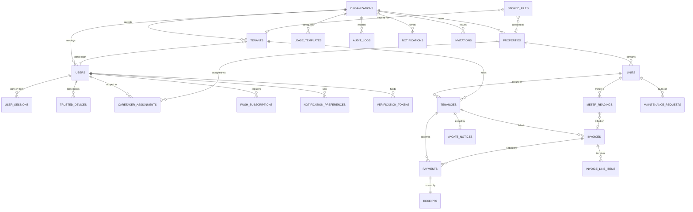

# RentFlow Kenya — Data Model

> Phase 1 schema. Generated against Alembic head `2c1d19d1badc`.

## Multi-tenant isolation strategy

Every tenant-owned table carries `organization_id`, supplied by the
`OrgScopedMixin` in [`app/models/base.py`](../backend/app/models/base.py) rather
than repeated per model. Isolation is enforced twice, deliberately:

1. **Application layer** — `app.api.deps.OrgContext` resolves the caller's
   organization on every request, and `assert_in_org` is the single place that
   decides a cross-tenant read is a **403, never a 404**. A 404 would confirm the
   id exists.
2. **Database layer** — PostgreSQL Row Level Security. Every tenant table has a
   policy comparing `organization_id` against the transaction-scoped setting
   `app.current_org_id`. With no context set, policies match **nothing**, so a
   forgotten scope is an empty result rather than a silent leak.

Table owners bypass RLS, which is what allows Celery tasks and the unauthenticated
M-Pesa callback to work across organizations. In production, grant day-to-day
access to a non-owner role so the policies actually bite.

Caretakers get a third layer: `caretaker_assignments` limits them to named
properties, and `accessible_property_ids` folds that into every portfolio query.

---

## Entity relationship diagram



---

## Tables

### Identity and access

| Table | Purpose | Key constraints |
|---|---|---|
| `organizations` | The SaaS tenant. Everything hangs off this. | `slug` unique |
| `users` | Staff and tenant-portal logins across all 8 roles. | `email`, `phone_number` globally unique |
| `user_sessions` | One live login. Holds the **hash** of the current refresh token so rotation can detect reuse. | indexed on `refresh_token_hash` |
| `trusted_devices` | Devices that completed 2FA and asked to be remembered (30 days). | |
| `verification_tokens` | Single-use hashed link tokens: email verification, password reset, tenant-portal invite. | `token_hash` unique |
| `invitations` | Staff invitations with seeded property assignments and cash limit. | `token_hash` unique |

Refresh tokens rotate on every use. Presenting a *superseded* token is treated as
theft and revokes every session the user has — see `session_service.rotate`.

### Portfolio

| Table | Purpose | Key constraints |
|---|---|---|
| `properties` | Buildings, blocks, fleets. Carries the per-unit water and electricity rates that price meter readings. | `(organization_id, reference_code)` unique |
| `units` | The rentable thing. Status is a consequence of tenancy, never set by hand. | `(property_id, unit_number)` unique |
| `caretaker_assignments` | Which properties a caretaker may operate on, plus their cash ceiling. | `(user_id, property_id)` unique |

Unit statuses: `vacant`, `occupied`, `under_maintenance`, `reserved`, `vacating`.

### Tenancy

| Table | Purpose | Key constraints |
|---|---|---|
| `tenants` | The person, their KYC documents and emergency contact. | `(organization_id, phone_number)` unique |
| `tenancies` | The rental relationship. Status is **derived from dates**, never stored by hand. | `(organization_id, reference_code)` unique |
| `lease_templates` | Landlord-authored lease body with `{{variable}}` placeholders; versioned. | |

Tenancy statuses derive from `start_date`, `end_date`, `notice_given_at` and
`vacated_at` in `tenant_service._derive_status`: `active`, `expiring_soon`
(within 60 days), `expired`, `notice_given`, `vacated`.

### Money

| Table | Purpose | Key constraints |
|---|---|---|
| `invoices` | One per tenancy per billing period. | `(tenancy_id, period_start)` unique — this is what makes the daily Celery run idempotent |
| `invoice_line_items` | Rent, utilities, arrears carried forward, late fees. | |
| `payments` | M-Pesa, cash, bank or cheque. | `mpesa_receipt` **globally unique** — the same money can never be banked twice |
| `receipts` | Tamper-evident proof. `signature` is an HMAC over the immutable facts. | `payment_id` unique |

Money is `NUMERIC(12,2)` throughout and handled as Python `Decimal` — never float.

Payments settle **oldest invoice first** (`payment_service._allocate`).

### Operations

| Table | Purpose | Key constraints |
|---|---|---|
| `meter_readings` | Water/electricity with a **mandatory photo**. Consumption and amount are computed at capture time, so a later rate change never rewrites past bills. | `(unit_id, meter_type, reading_date)` unique |
| `maintenance_requests` | Faults from caretakers and tenants, with photos and priority. | `(organization_id, reference_code)` unique |
| `vacate_notices` | Tenant's digital notice, validated against the lease's notice period. | |
| `stored_files` | Metadata for objects in Cloudflare R2. Bytes never pass through the API. | `storage_key` unique |
| `audit_logs` | Append-only. Doubles as the caretaker activity log — hence the optional GPS columns. | indexed on `(entity_type, entity_id)` and `(organization_id, created_at)` |

### Communications

| Table | Purpose |
|---|---|
| `notifications` | One row **per channel per event**, so a partial failure is visible |
| `notification_preferences` | Per-user opt-outs. A missing row means enabled — users only store exceptions |
| `push_subscriptions` | Web Push endpoints, one per browser |

Payment, receipt, security and account notifications are **mandatory** and ignore
preferences (`notification_service.MANDATORY_TYPES`).

---

## Reference codes

Random rather than sequential, so a competitor cannot infer portfolio size from a
code. The alphabet excludes `I`, `O`, `0` and `1` because codes get read aloud
and written down.

| Prefix | Entity | Example |
|---|---|---|
| `PRP-` | Property | `PRP-7K2M9Q` |
| `UNT-` | Unit | `UNT-4XB8ZH` |
| `TNT-` | Tenant | `TNT-5HFKHU` |
| `TCY-` | Tenancy | `TCY-3WR6XE` |
| `INV-` | Invoice | `INV-2026-09-L7FGJ` |
| `PMT-` | Payment | `PMT-M2SBRS` |
| `RCT-` | Receipt | `RCT-KMZ975` |
| `MNT-` | Maintenance | `MNT-QB4T7D` |

---

## Migrations

| Revision | Contents |
|---|---|
| `978bef97001b` | Initial: organizations, users |
| `becdc2a16b45` | Phase 1: portfolio, tenancy, billing, operations, notifications |
| `2c1d19d1badc` | Row Level Security policies |

```bash
cd backend
alembic upgrade head          # apply
alembic downgrade -1          # roll back one
alembic revision --autogenerate -m "..."   # after changing models
```

Autogenerate against a current database should produce an **empty** migration —
if it doesn't, the models and the schema have drifted.
